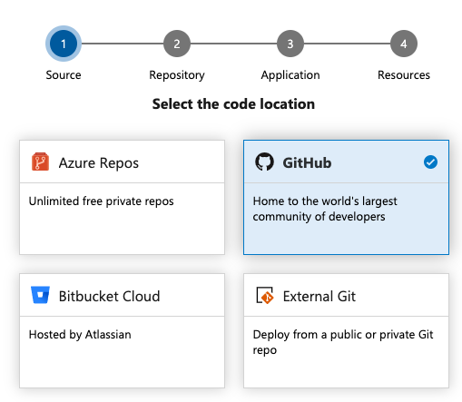
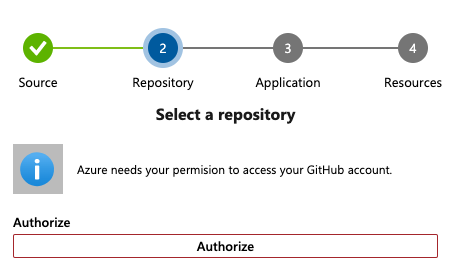
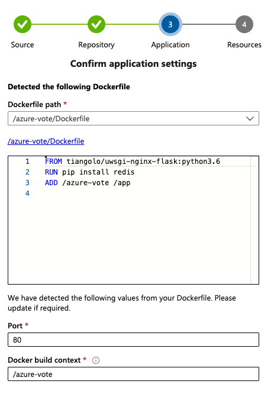
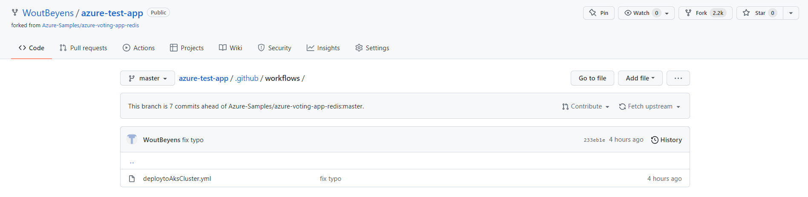

# Één enkele applicatie deployen op de Kubernetes cluster via Github Actions

## Vereisten

1. AKS Cluster opzetten a.d.h.v. Terraform 
   1. Bekijk puntje 1 in de [`README.md`](../../README.md) file.
2. Een applicatie naar keuze waarin reeds een Dockerfile zit. Of je kan ook een fork nemen van de testapplicatie in de repo van: https://github.com/MicrosoftDocs/mslearn-aks-deployment-pipeline-github-actions


## 1. Github linken aan *portal.azure*

Ga naar [portal.azure](https://portal.azure.com/#home)

1. Open de resourcegroup die de k8s cluster bevat en ga naar die AKS cluster in de Azure portal (portal.azure.com)
2. Ga naar "Deployment Center"
3. Voeg een project toe en selecteer 'Github'
   


4. Geef de deployment toegang tot de Github repo die de source code bevat. Dit is nodig zodat de Github Actions pipeline kan gegereneerd worden in de Github repo.
5. Check of de juiste Dockerfile is aangeduid



6. Check de container registry



7. Klik op *done*
8. Indien deze error verschijnt "Container registry admin user is not enabled. Either enable admin user or choose other container registry". Ga da via een ander tabblad naar de resource group, klik dan op de resource group die daar in zit, vervolgens klik je links op "Access keys" en vink je *enabled* aan bij 'Admin user'. Ga da weer terug naar vorig tabblad en klik opnieuw op *done*.
9.  Ga nu naar de Github repo en check de .github/workflows folder



## 2. In Azure Cloud

```bash
wout@Azure:~$ az aks get-credentials --name devops-cluster-aks --resource-group aks_tf_rg --admin
Merged "devops-cluster-aks-admin" as current context in /home/wout/.kube/config
wout@Azure:~$ kubectl get nodes
NAME                             STATUS   ROLES   AGE   VERSION
aks-system-16862707-vmss000000   Ready    agent   35m   v1.21.7
aks-system-16862707-vmss000001   Ready    agent   36m   v1.21.7
wout@Azure:~$ kubectl get pods
No resources found in default namespace.
wout@Azure:~$ kubectl get pods
No resources found in default namespace.
wout@Azure:~$ kubectl get namespaces
NAME                STATUS   AGE
default             Active   41m
gatekeeper-system   Active   31m
kube-node-lease     Active   41m
kube-public         Active   41m
kube-system         Active   41m
namespacetestwb     Active   66s
wout@Azure:~$ kubectl get pods -n namespacetestwb
NAME                                    READY   STATUS    RESTARTS   AGE
devopsclusteraks-d36e-cbbd98d48-4tnb8   1/1     Running   0          72s
devopsclusteraks-d36e-cbbd98d48-4vs6v   1/1     Running   0          72s
wout@Azure:~$ kubectl get all
NAME                 TYPE        CLUSTER-IP   EXTERNAL-IP   PORT(S)   AGE
service/kubernetes   ClusterIP   10.0.0.1     <none>        443/TCP   41m
wout@Azure:~$ kubectl get all -n namespacetestwb
NAME                                        READY   STATUS    RESTARTS   AGE
pod/devopsclusteraks-d36e-cbbd98d48-4tnb8   1/1     Running   0          96s
pod/devopsclusteraks-d36e-cbbd98d48-4vs6v   1/1     Running   0          96s

NAME                            TYPE           CLUSTER-IP     EXTERNAL-IP     PORT(S)        AGE
service/devopsclusteraks-d36e   LoadBalancer   10.0.186.175   20.50.242.140   80:30662/TCP   96s

NAME                                    READY   UP-TO-DATE   AVAILABLE   AGE
deployment.apps/devopsclusteraks-d36e   2/2     2            2           96s

NAME                                              DESIRED   CURRENT   READY   AGE
replicaset.apps/devopsclusteraks-d36e-cbbd98d48   2         2         2       96s
wout@Azure:~$ 
```

Surf daarna naar de EXTERNAL-IP, hier "20.50.242.140".

## 3. Uitleg over de workflow file

```yaml
# We name the workflow file for clarity
name: GO Application

# First part of the CI workflow contains the which action trigger the workflow, here the CI workflow has to be triggered manually.
on: workflow_dispatch

# Next we look into the jobs. Each job is grouped by a "-"
jobs:
  build-and-deploy:
    runs-on: ubuntu-latest   # takes the latest version of ubuntu to run the app on.
    steps:
    # Next, we use an action to build a docker image and push the build image to ACR.
    - uses: actions/checkout@master
    
    - uses: azure/docker-login@v1
      with:
        login-server: myacr4568975.azurecr.io
        username: ${{ secrets.acr_myacr4568975_username }}
        password: ${{ secrets.acr_myacr4568975_password }}
    
    - name: Build and push image to ACR
      id: build-image
      run: |
        docker build "$GITHUB_WORKSPACE/" -f  "Dockerfile" -t myacr4568975.azurecr.io/devopsclusteraks:${{ github.sha }} --label dockerfile-path=Dockerfile
        docker push myacr4568975.azurecr.io/devopsclusteraks:${{ github.sha }}

    # Next use Azure AKS context to login to the AKS cluster for application deployment.
    - uses: azure/k8s-set-context@v1
      with:
         kubeconfig: ${{ secrets.aks_devopsclusteraks_kubeConfig }}
      id: login
    
    # Create a namespace
    - name: Create namespace
      run: |
        namespacePresent=`kubectl get namespace | grep namespacetestwb | wc -l`
        if [ $namespacePresent -eq 0 ]
        then
            echo `kubectl create namespace namespacetestwb`
        fi
    
    # Next, create an ImagePullSecret to push the image from a private ACR repository.
    - uses: azure/k8s-create-secret@v1
      with:
        namespace: namespacetestwb
        container-registry-url: myacr4568975.azurecr.io
        container-registry-username: ${{ secrets.acr_myacr4568975_username }}
        container-registry-password: ${{ secrets.acr_myacr4568975_password }}
        secret-name: devopsclustedockerauth
    
    # Next, deploy the application using the YAML manifests. For this application, we use deployment and a LoadBalance service. YAML files can be found in this repo under manifests.
    - uses: azure/k8s-deploy@v1.2
      with:
        namespace: namespacetestwb
        manifests: |
          manifests/deployment.yml
          manifests/service.yml
        images: |
          myacr4568975.azurecr.io/devopsclusteraks:${{ github.sha }}
        imagepullsecrets: |
          devopsclustedockerauth
```