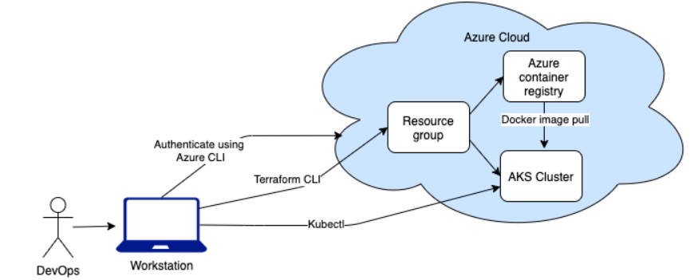

# CICDaas-store

Deze repository zal CICD as a service aanbieden aan de klant. Zo kan de klant zelfstandig aan de slag gaan om CICD op te zetten via een simpele guide die door de klant gevolgd kan worden. Zo is het mogelijk dat de klant bijvoorbeeld een bepaalde programmeertaal in een placeholder kan invullen en zelf de code aanpassen aan de hand van een eenvoudige guide met code snipets zodat de modulaire pipeline ook zal werken voor een applicatie met een andere soort programmeertaal.

## 1. Het opzetten van een Kubernetes cluster in Azure

In dit onderdeel zal er getoond worden hoe je een Kubernetes cluster op kan zetten op een platform naar keuze. In deze guide wordt er voor Azure gekozen en zal er een Azure Kubernetes Service (AKS) opgezet worden.

We kunnen de AKS cluster op verschillende manieren opzetten (via de Azure portal, Azure CLI of Terraform). Hier gaan we de cluster opzetten via dat laatste, Terraform.



**Enkele vereisten:**

- Terraform moet geïnstalleerd zijn op de machine
- Een Azure account met een geldige subscriptie
- Kubectl moet geïnstalleerd zijn op de machine
- Azure CLI moet geïnstalleerd zijn op de machine

### 1.1 Inloggen op Azure

We moeten eerste op de Azure portal inloggen via de Azure CLI.

```bash
az login
```

Dit opent een venster in de browser waarin je kan inloggen op het gewenste Azure account.

### 1.2 Een aantal nodige bestanden

Om deze cluster te kunnen opzetten dienen er een aantal bestanden aangemaakt te worden. Deze bestanden kunnen ook gevonden worden in het mapje `[aks-files](https://github.com/WoutBeyens/CICDaas-store/tree/main/aks-files)`.